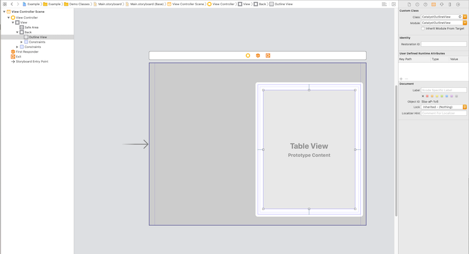

# CatalystOutlineView
NSOutlineView for UIKit (recreation of popular control from AppKit)

The behavior is implemented with the maximum functionality of the classic component and is slightly expanded

## Overview


## Requirements

* iOS 13.0+ (macCatalyst)
* Swift 5

## Installation

### Manually

Just add the `Source` folder to your project.

### CocoaPods

use [CocoaPods](https://cocoapods.org) with Podfile:
``` ruby
pod 'CatalystOutlineView', '~> 0.1'
```

## Usage

### 🎨 Storyboards
Just drop UITableView and set its class to be one of CatalystOutlineView.



### 💻 Code
``` swift
private var outline = CatalystOutlineView(frame: .zero) {
    didSet {
        outlineView.outlineDataSource = self
        outlineView.outlineDelegate = self
    }
}
```

## Setup
### DataSource and Delegate

### Connect control for your class
``` swift
@IBOutlet private(set) weak var outlineView: CatalystOutlineView!
```
than set outlineDataSource and outlineDelegate properties

``` swift
outlineView.outlineDataSource = self
outlineView.outlineDelegate = self
```

## Then you should implement:

### CatalystOutlineViewDataSource
``` swift
func outlineView(_ outlineView: CatalystOutlineView, numberOfChildrenOfItem item: Any?) -> Int
func outlineView(_ outlineView: CatalystOutlineView, child index: Int, ofItem item: Any?) -> Any
func outlineView(_ outlineView: CatalystOutlineView, isItemExpandable item: Any) -> Bool
```

### CatalystOutlineViewDelegate
``` swift
func outlineView(_ outlineView: CatalystOutlineView?, cellForItem item: Any?) -> UITableViewCell?
func outlineView(_ outlineView: CatalystOutlineView?, shouldCollapseItem item: Any?) -> Bool
func outlineView(_ outlineView: CatalystOutlineView?, didExpandItem item: Any?)
func outlineView(_ outlineView: CatalystOutlineView?, didCollapseItem item: Any?)
func view(forHeader outlineView: CatalystOutlineView?) -> UIView?
func height(forHeader outlineView: CatalystOutlineView?) -> CGFloat
func height(forCell outlineView: CatalystOutlineView?, ofItem item: Any?) -> CGFloat

// if you want context menu for your outlineView
func contextMenuConfiguration(for item: Any?) -> UIContextMenuConfiguration?
```


### Your cell maybe conformed for ExpandCollapseDisplaying protocol

``` swift 
func expand()
func collapse()
```

Also you can check 'Example' project from repo!

## License
CatalystOutlineViewDelegate is released under the MIT license. See [LICENSE](./LICENSE) for details.
